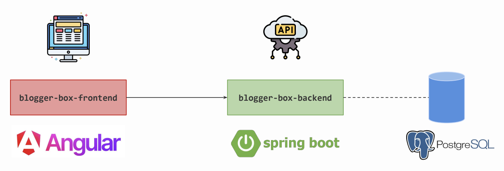
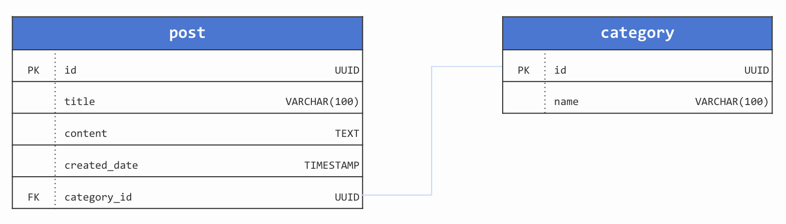

# Architecture

  

# Database diagram

  

# Documentation 
Via swagger : [localhost:8080/swagger-ui/index.html](http://localhost:8080/swagger-ui/index.html#/)

# Database credentials
Create your own database, either locally or remotely (via [ElephantSQL](https://www.elephantsql.com/), [Supabase](https://supabase.com/), [Heroku](https://www.heroku.com/), [Neon](https://neon.tech/)...)

# Course material
Web Programming course about constructing web application as part of Master's degree in business informatics (MIAGE) @ Paris Dauphine University (PSL)

| Session | Date       | Instructor                                        | Description                                                                                                                                                    |
|---------|------------|---------------------------------------------------|----------------------------------------------------------------------------------------------------------------------------------------------------------------|
| `#01`   | 02/04/2024 | [elieahd](https://github.com/elieahd)             | [Overview of Web development](https://drive.google.com/file/d/11One7fJDrS5ji3vojavXtsX70_DcqRoM/view?usp=drive_link)                                           |
| `#02`   | 03/04/2024 | [bilal-elchami](https://github.com/bilal-elchami) | [Angular Getting Started](https://drive.google.com/file/d/1FzGDdODKGF6JPQkFPthgcJGCneJQdTVv/view?usp=drive_link)                                               |
| `#03`   | 22/04/2024 | [elieahd](https://github.com/elieahd)             | [Building a backend application with Spring Boot](https://drive.google.com/file/d/1t2Gca1C1giOdv3LYJIkvH_a4GfcPC38L/view?usp=drive_link)                       |
| `#04`   | 25/04/2024 | [elieahd](https://github.com/elieahd)             | [Implementing RESTful API with JPA](https://drive.google.com/file/d/1EKiskNB5uvD7SV2sKR-QN_Ae-QTBiJ1A/view?usp=drive_link)                                     |
| `#05`   | 13/05/2024 | [bilal-elchami](https://github.com/bilal-elchami) | [Hands on frontend (Part 1)](https://drive.google.com/file/d/1tMLBh7upGqAAG2b75dj0EAloimAoYrt7/view?usp=drive_link)                                            |
| `#06`   | 16/05/2024 | [bilal-elchami](https://github.com/bilal-elchami) | [Hands on frontend (Part 2)](https://drive.google.com/file/d/1XAzKjVyCffgJXh31g6Hri2OsL-UHBtH_/view?usp=drive_link)                                            |
| `#07`   | 03/06/2024 | [elieahd](https://github.com/elieahd)             | [Response and exception handling](https://drive.google.com/file/d/1dCUjRT1v-t7SEmIllgHiZ-1sgQ4czCbo/view?usp=drive_link)                                       |
| `#08`   | 06/06/2024 | [bilal-elchami](https://github.com/bilal-elchami) | [Beyond Frontend](https://drive.google.com/file/d/1fpZtw4BfP6jVqkjoaTR1FnDAYS8j0P2S/view?usp=drive_link)                                                       |
| `#09`   | 17/06/2024 | [elieahd](https://github.com/elieahd)             | [TP Review](https://drive.google.com/file/d/1bvqJL4A8vq73hJxQoB90ugS8lX8ijydE/view?usp=drive_link) & Dedicated session for final project (focus on `backend`)  |
| `#10`   | 20/06/2024 | [bilal-elchami](https://github.com/bilal-elchami) | Dedicated session for final project (focus on `frontend`)                                                                                                      |

# Pipelines
| Event     | Description                                     | Workflow                                                         |
|-----------|-------------------------------------------------|------------------------------------------------------------------|
| on `push` | checkout code, build project and run unit tests | [`.github/workflows/test.yml`](.github/workflows/pr-checks.yml) |